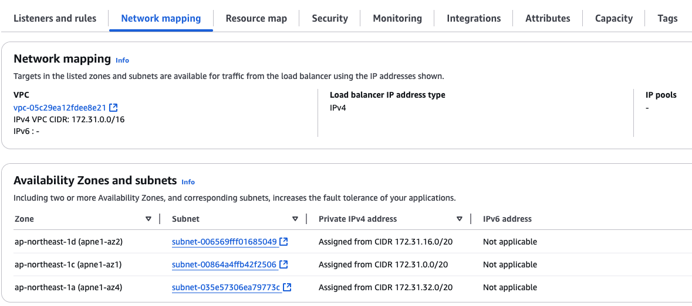
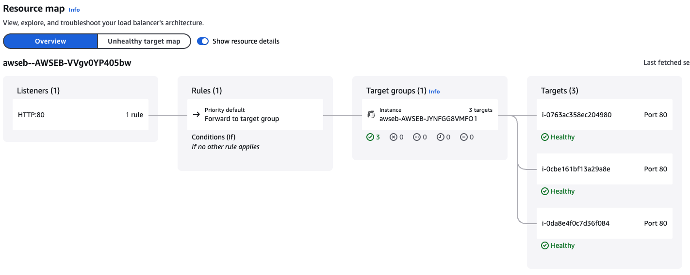

# application load balancer

alb-network-map

alb-resource-map.png

alb-rule-target-group.png

# nslookup
EB and Load Balancer domain points to same IPs.

## EB

nslookup beanstalk-dev.ap-northeast-1.elasticbeanstalk.com
Server:		192.168.1.254
Address:	192.168.1.254#53

Non-authoritative answer:
Name:	beanstalk-dev.ap-northeast-1.elasticbeanstalk.com
Address: 52.197.210.51
Name:	beanstalk-dev.ap-northeast-1.elasticbeanstalk.com
Address: 54.65.231.154
Name:	beanstalk-dev.ap-northeast-1.elasticbeanstalk.com
Address: 52.68.51.71

## Load balancer
nslookup AWSEB--AWSEB-VVGV0YP405BW-241533953.AP-NORTHEAST-1.ELB.AMAZONAWS.COM
Server:		192.168.1.254
Address:	192.168.1.254#53

Non-authoritative answer:
Name:	AWSEB--AWSEB-VVGV0YP405BW-241533953.AP-NORTHEAST-1.ELB.AMAZONAWS.COM
Address: 54.65.231.154
Name:	AWSEB--AWSEB-VVGV0YP405BW-241533953.AP-NORTHEAST-1.ELB.AMAZONAWS.COM
Address: 52.197.210.51
Name:	AWSEB--AWSEB-VVGV0YP405BW-241533953.AP-NORTHEAST-1.ELB.AMAZONAWS.COM
Address: 52.68.51.71